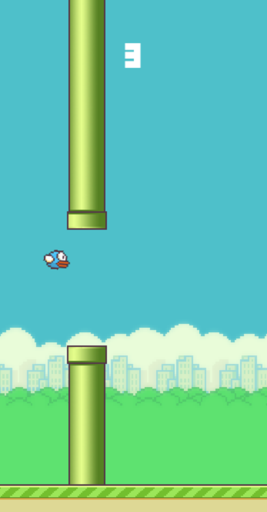

# Read Me
* This is a flappy bird made with pygame, built as a learning project for myself.
* To play this game: 
    1. Download the code ZIP.
    2. In your terminal/command palette:
        ```
        pip install pygame
        python main.py
        ```
        or
        ```
        pip3 install pygame
        python3 main.py
        ```

    3. Enjoy!
* In-game snapshots

